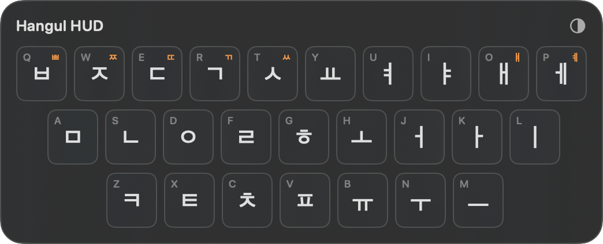
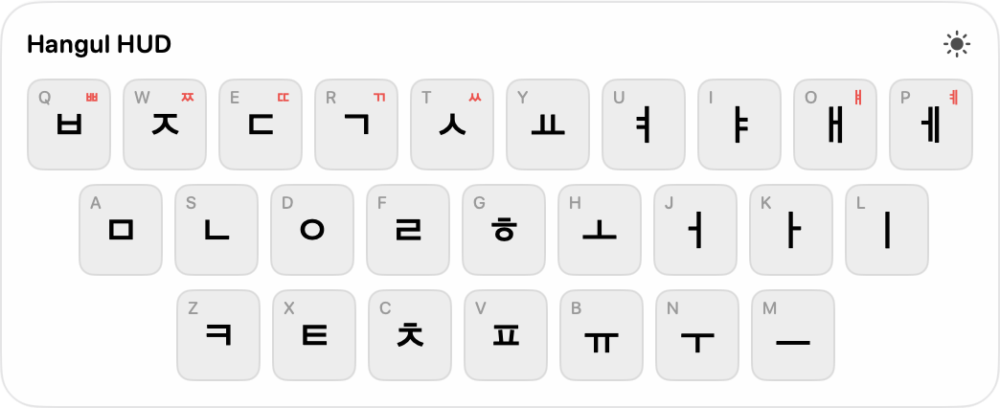
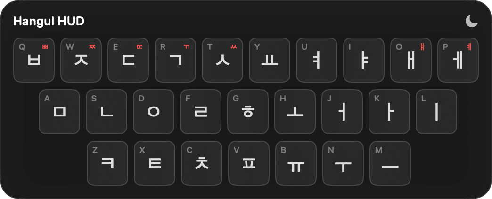
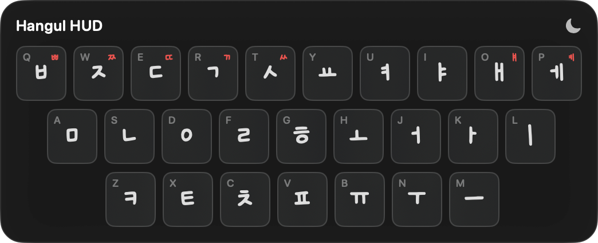
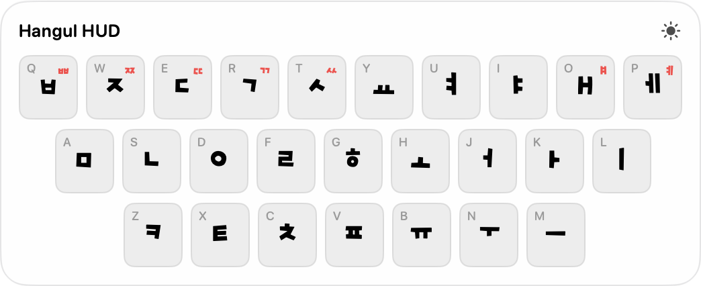
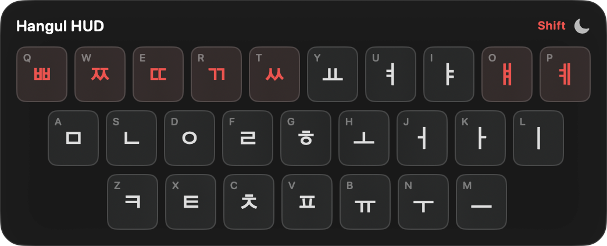

# Hangul HUD 🇰🇷

A macOS menu-bar utility that shows a floating Korean keyboard overlay whenever Korean input is active.

*With this, I can now spam in 한글.*

Check out the app [here.](https://wheevu.dev/hangul-hud)

&nbsp;&nbsp;&nbsp;&nbsp;&nbsp;&nbsp;&nbsp;&nbsp;&nbsp;&nbsp;&nbsp;&nbsp; 

## Themes

  
 

## Fonts

 

Three keycap font options are available from the menu bar:

- **Default** — system rounded font
- **Style 1** — Ownglyph mongmongdays (cute handwritten style)
- **Style 2** — OkDanDan Bold (bold rounded style)

The selected font persists across launches.

## Features

- **Shift layer** — holding Shift swaps Q/W/E/R/T/O/P keys to their double-consonant/compound-vowel variants (ㅃ/ㅉ/ㄸ/ㄲ/ㅆ/ㅒ/ㅖ) with accent highlighting.

- **Auto-detection** — overlay appears automatically when any Korean input source is active (2-Set, 3-Set, Romaja, etc.), hides when switching away.
- **Floating overlay** — always on top, stays visible while typing in other apps, movable by dragging.
- **Compact mode** — hides English labels for a smaller, cleaner HUD.
- **Click-through** — when enabled, clicks pass through the HUD to the app behind it.
- **Opacity slider** — adjustable from the menu bar dropdown.
- **Position memory** — drag the HUD anywhere; position persists across launches.
- **Menu bar icon** — turns orange when Korean input is active.

## Privacy & permissions

- Hangul HUD does **not** use networking and does not send data anywhere.
- Korean input detection uses macOS input-source APIs; it does not read typed text.
- **Live Shift Layer** is optional. When enabled, the app monitors global modifier-flag changes so the HUD can show Shift variants while you type in other apps. It only checks whether Shift is pressed; it does not inspect characters or key contents.
- If you do not enable Live Shift Layer, the app should not need Accessibility or Input Monitoring permission for normal input-source detection.
